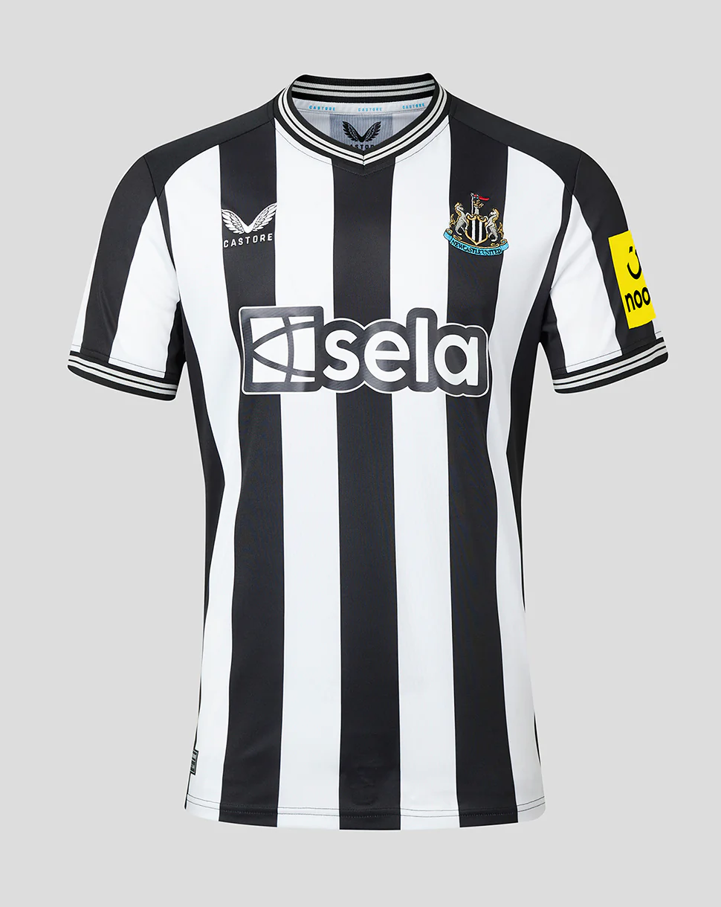

# Newcastle, City on the tyne and surrounding areas 
## Milestone Project 1 - static Front-end Website 

* City on the Tyne, is a prospective tourist website, built and curated by people who live in Newcaslte and the surrounding areas.

* This is my submission for my Code institue's Milestone project one in my Web Apllication Development course, show casing What i have learned in HTML and CSS development 

## [Live project]( )

## [ MSP repository ] (https://github.com/Fergy311/course-reposi)

## contents 
- [User Experience] (#user-experience)
    * [Prospective users] (prospective-users)
        + [Future tourists] (Future-tourists)
        + [University students] (university-students)
        + [Curators for site] (Curators-for-the-site)
    - [Design](#design)
        + [Colour Scheme](#colour-scheme)
        + [Imagery](#imagery)
        + [Icons](#icons)
    - [Structure](#structure)
        + [Information Architecture](#information-architecture)
        + [Navigation Bar](#navigation-bar)
        + [Footer](#footer) 

# User Experience

### Prospective users

* These are users who may use the website to plan a trip to or just around Newcaslte as a city and are intersed in everything Newcastle has to offer

    * As a perspective user i would like to see what places i can visit and what is currently on at those places 
    * As a perspective user i would like to see What Newcaslte has to offer and why i should plan a trip there rather than somewhere else
    * As a perspective user i would like to see Pictures of the city and surrounding areas  
        
### Future tourists 

*These users may be more interested in the more tourist attractions Newcaslte has to offer 

    * As a future tourist i would like to see Places to visit in the Town such as museums, 
        galleries and theatres
    * As a future tourist i would like to see when these places are open 
    * As a future tourist i would like to see if these places offer guided tours 

### University students 

* These users Will be spending a lot of time in newcastle over the course of thier studdies and will use the website to find sporting events or about general history of the town.

    * As a university student i would like to see Sporting events held in the city
    * As a university student i would like to see historical sites around the city 

### Curators for the website 

* These users would like to get involved with the site 

    * As a curator i would like to see Photography of the city
    * As a curator i would like to see Inspiration for others 
    * As a curator i would like to see ways i can get involved in improving the website itself

### Design
 <h2 align="center">

 - A simple colour palette for the site based off the NUFC Football teams  Home colours.
 - The Footer colour also keep this pattern with a black background with white texts and icons

 ### typography 

 - Headings along with body texts are in oswald as i feel it's a smart and professional looking font that conveys information well.

 ### imagary 

 - Imagery is a very important feature of the website, as the website needs to appeal visually to users and represent the City in a good light.

 ### Icons 

 -  used icons from Font Awesome to encourage users to click on buttons and to add clear visual indicators to sections on the About page.

 ## Future Features

### Events
- There could be an events section with a booking form, allowing users to book tickets for upcoming events.

### Past Exhibitions
- There could be an archive of past exhibitions at locations fetured on this site 

# Technologies Used

## Languages Used

- [HTML5](https://en.wikipedia.org/wiki/HTML5)

- [CSS3](https://en.wikipedia.org/wiki/CSS)

## Frameworks Libraries and Programs

- [Bootstrap 4](https://getbootstrap.com/) 
  - I used bootstrap throughout the site to make it responsive. The website uses Bootstrap's Containers, Grid System and Flexbox and Button classes. I sourced code from the Bootstrap documentation when building the Navbar, Carousel, Buttons and Contact Form, 
  
- [Google Fonts](https://fonts.google.com/)
  - Two fonts were imported from google fonts. Josefin Sans for the headings, and Lato for the other text.
  
- [Font awesome](https://fontawesome.com/)
  - I used icons from font awesome to visually distinguish sections of the text and on buttons.

- [Git](https://git-scm.com/)
  - Git was used as a version control in the terminal.

- [Github](https://github.com/)
  - Github was used to create and store the project repository.
  
  # Deployment

## GitHub Pages

The project was deployed to GitHub Pages using these steps:

1. Log in to GitHub and go to the [GitHub Repository]()
2. Locate the Navbar at the top of the Repository (not top of page). Click the Settings tab.
3. Locate the Navbar on the left hand side of the page. Click the "Pages" section (under 'Code and automation').
4. Under "Source", click the dropdown called "None" and select "main". Click save.
5. The page will automatically refresh.
6. A notification will appear at the top of the page with the [link]() to the deployed site. You can return to this GitHub Pages section to access the link.

# Credits

## Code

-   [Bootstrap4](https://getbootstrap.com/docs/4.4/getting-started/introduction/): Bootstrap Library was used throughout the project mainly to make site responsive using the Bootstrap Grid System and Flexbox. I sourced code from the Bootstrap documentation when building the Navbar, Carousel, Buttons and Contact Form. 

-   [Code Institute](https://codeinstitute.net/): I referred to lessons and source code from Code Institute's Web Application Development course. I sourced code for the footer social icons from the CV Project, and referred to the code from the Coders Coffee House project for the Google Maps iFrame.

